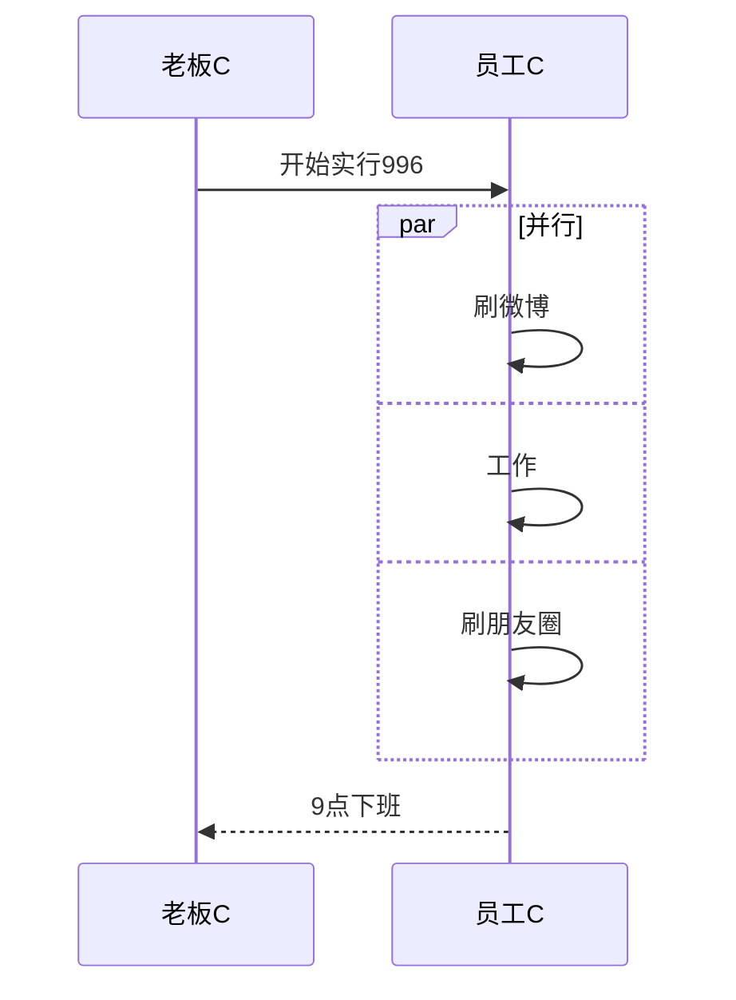

+++ 
date = 2022-08-17T19:58:53+08:00
title = "Test mermaid diagram"
description = ""
slug = ""
authors = []
tags = []
categories = []
externalLink = ""
series = []
+++

```mermaid 
sequenceDiagram
    老板C ->> 员工C : 开始实行996
    
    par 并行
        员工C ->> 员工C : 刷微博
    and
        员工C ->> 员工C : 工作
    and
        员工C ->> 员工C : 刷朋友圈
    end
    
    员工C -->> 老板C : 9点下班
```
